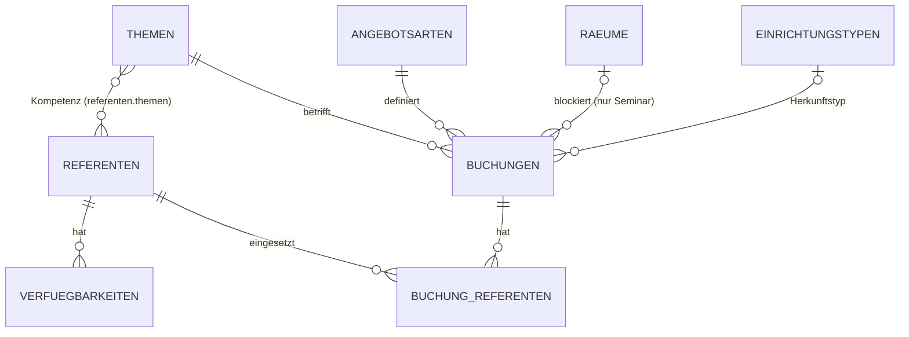

# SPEC.md — Buchungssystem Gedenkstätte Deutscher Widerstand

**Status:** in Betrieb (fortgeschrieben) · **Stand:** 2026-07-14 (Basis), Nachträge nach Migrationen 0003–0007 · **Sprache UI:** Deutsch · **Rolle Autor:** Chef-Architekt (Konsolidierung der 4 Spezialisten-Entwürfe)

> **Nachtrag-Hinweis:** Dieses Dokument beschreibt in seinem Grundgerüst den Vor-Implementierungs-Stand. Schema, Access-Rules und Routen wurden seither über die Migrationen **0003–0007** und zusätzliche Route-Cluster fortgeschrieben. Die betroffenen Abschnitte (§0 E12+, §2.3, §3.7, §4, §5, §7–§9) enthalten entsprechend markierte **Nachträge**, die im Konfliktfall gegenüber dem ursprünglichen Text **Vorrang** haben. Maßgebliche Wahrheit bleibt der Quelltext in `pb_hooks/`.

---

## 0. Widerspruchsauflösung (verbindliche Entscheidungen)

Die vier Entwürfe widersprechen sich an mehreren Stellen. Hier die getroffenen Entscheidungen; sie gelten für den Rest des Dokuments.

| # | Konflikt | Entwürfe | Entscheidung | Begründung |
|---|---|---|---|---|
| E1 | Namenskonvention Collections/Felder | Datenmodell: englisch (`speakers`, `bookings`); Algorithmus/Backend: deutsch (`referenten`, `buchungen`) | **Durchgängig deutsch** für Collections, Felder, Routen, JSON-Keys | Domäne, UI, Team, Brief sind komplett deutsch; 2 von 3 restlichen Entwürfen nutzen deutsch; vermeidet DE/EN-Kontextwechsel. Die *Rigorosität* des Datenmodell-Entwurfs (Access-Rule-Semantik, Typen, Defaults, Indizes) wird übernommen und nur umbenannt. |
| E2 | Auth-Collection | `staff` vs. `mitarbeiter` | **`mitarbeiter`** | Backend-Entwurf + deutsche Konvention. |
| E3 | Wie entsteht eine Buchung? | Datenmodell: öffentliche `createRule` + Go-Hook; Backend: `createRule=null`, **nur** Custom-Route | **`buchungen.createRule = null`; einziger Schreibpfad ist `POST /api/public/buchungsanfrage`** (Systemrechte-Save im Handler) | Rate-Limit, Body-Limit, Honeypot, Kapazitäts-Recheck-in-Transaktion und Minimal-Response sind über eine Custom-Route sauber erzwingbar; eine Filter-`createRule` kann Overlap/Kapazität nicht prüfen und lässt Feld-Bypass-Risiken. |
| E4 | Verfügbarkeits-API | Datenmodell/Backend: 1 Endpoint gibt alle Slots im Range; UX: 2 Endpoints (Tage-Status + Slots) mit `restplaetze` | **2 Endpoints** (`/verfuegbarkeit/tage`, `/verfuegbarkeit/slots`), **ohne** exakte Restplatz-/Referentenzahlen — nur `frei\|knapp\|ausgebucht` bzw. `buchbar:bool` | UX-freundliche Kalender-dann-Slot-Navigation + kleinere Payload; Sicherheits-Constraint (kein Scraping exakter Kapazitäten) bleibt gewahrt. |
| E5 | Referentenbedarfs-Formel | Datenmodell: `min_referenten` + `participants_per_speaker`; Algorithmus/Backend: `ceil(g / betreuungsschluessel)` | **`benoetigt = max(min_referenten, ceil(gruppengroesse / betreuungsschluessel))`**; `betreuungsschluessel` leer ⇒ nur `min_referenten` | Vereint beide Modelle; deckt „immer 1" wie auch „+1 je N Teilnehmende" ab. |
| E6 | Verfügbarkeitsmodell Referent | Datenmodell: `art`×`wiederholung` (4 Kombis); Algorithmus: `typ ∈ {regel, ausnahme_frei, ausnahme_gesperrt}` | **Datenmodell-Ansatz** (`art ∈ {verfuegbar, gesperrt}` × `wiederholung ∈ {einmalig, woechentlich}`) | Ausdrucksstärker (erlaubt auch wiederkehrende Sperren), subsumiert die 3 Algorithmus-Typen sauber. |
| E7 | Status-Enum Buchung | 3 unterschiedliche Sets | **`angefragt, bestaetigt, abgelehnt, storniert, verfallen, durchgefuehrt`** | No-Show ⇒ `durchgefuehrt` + `teilnehmer_ist=0` statt eigenem Status (vermeidet Status-Explosion). „abgeschlossen" der Reports = `durchgefuehrt`. |
| E8 | Ist-Erfassung Referent | Datenmodell: `deployed:bool`; Algorithmus: `war_anwesend`, Soft-Delete `status=entfernt` | **Boolean-Modell** (`geplant`, `eingesetzt`, `quelle`), kein `entfernt`-Status; Audit der Ursprungsplanung über `buchungen.planung_snapshot` (JSON) | Weniger Zustände; Snapshot liefert Nachvollziehbarkeit ohne Soft-Delete-Zombies. |
| E9 | Transaktionsmails | Backend: generischer `OnRecordAfterUpdateSuccess`-Hook | **Explizit aus den jeweiligen Route-Handlern** (Eingangsbestätigung im Buchungsanfrage-Handler, Zu-/Absage in `bestaetigen`/`ablehnen`) | Vermeidet „welches Feld hat sich geändert?"-Ambiguität und Fehlmails bei beliebigen Updates. |
| E10 | Honeypot | Datenmodell: gespeichertes Feld; Backend: Request-Body-Feld | **Transientes Request-Body-Feld `firma_website`** (nicht persistiert) | Da Create nur über Custom-Route läuft, muss der Honeypot nicht in der DB liegen. |
| E11 | Max. Gruppengröße | zod max 60; Backend 1–200; Datenmodell per Angebotsart | **`angebotsarten.max_teilnehmer` maßgeblich**; `einstellungen.max_gruppengroesse_absolut` (Default 200) als harte Sanity-Obergrenze | Konfigurierbarkeit pro Angebotsart + globaler DoS-Schutz. |

### Nachträge zu §0 — Entscheidungen E12+ (Migrationen 0004–0007)

| # | Entscheidung | Umsetzung | Begründung |
|---|---|---|---|
| E12 | **Kapazitätshandling**: ein Halte-Status + weiche Overrides statt harter Blocks | Status `warteliste` (Verfall-Cron-immun) + Flags `unterbesetzt`/`raum_offen`/`bestaetigt_trotz_grund` (Migration `0004`) | Integritätsverletzung ≠ Kapazitätsengpass; Detail in `docs/KAPAZITAET.md`. |
| E13 | **3-Rollen-RBAC** statt „Rolle nur organisatorisch" | Rollen `leitung`/`mitarbeiter`/`auskunft`; Collection-Rules + Route-Guards + projizierende Auskunfts-Route (Migration `0007`) | Empfangs-/Schalterrolle mit minimalem Datenzugriff; Personal-Selbst-Eskalation geschlossen. |
| E14 | **QA-/Testmodus mit Rollen-Override** | Route-Cluster `routes_qa.go` hinter `TEST_MODE`; simuliertes „Jetzt" (`clock.go`) + Rollen-Override via Direkt-Write auf `rolle` | Abläufe (Verfall, Freischaltungen, Rollensichten) ohne echten Zeitverlauf testbar. |
| E15 | **Zweisprachigkeit (DE/EN) der öffentlichen Strecke** | Optionale `name_en`/`beschreibung_en` (Migration `0006`); Sprachwahl `?lang=en`; Fallback **rein im Frontend** | Englische Seite der Gedenkstätte ohne getrennte Datenpflege; Go-Routen bleiben sprachneutral. |
| E16 | **Ist-Erfassung tagesbasiert freischalten** (nicht uhrzeitbasiert) | `status==='durchgefuehrt' \|\| tagKey(heute) >= tagKey(start)` | Nacherfassung am selben Tag ohne Warten auf die Terminuhrzeit. |

---

## 1. Überblick & Architektur

**Zweck:** Ersetzt das manuell bearbeitete TYPO3-Kontaktformular durch ein sicheres Buchungssystem für kostenfreie **Führungen** und **Seminare** der Gedenkstätte. Öffentliches Anfrage-Tool (unauth., in TYPO3 eingebettet) + authentifiziertes Admin-SPA (Referenten-/Themen-/Raum-Verwaltung, Buchungsbearbeitung, automatische Referentenplanung mit Override, Soll/Ist-Tracking, Auswertungen).

**Ein Binary, ein Container, ein Port (8090), eine Domain** (`buchung.niaz.omg.lol`). Coolify/Traefik terminiert TLS.

```
                    Traefik (TLS) ──► buchung.niaz.omg.lol
                                          │
                          ┌───────────────┴────────────────┐
                          │   PocketBase-Binary (Go, :8090) │
                          ├─────────────────────────────────┤
   /  /embed  /admin/* ◄──┤  pb_public (statische SPA)      │  ← TanStack Start (SPA), shadcn
   /api/collections/* ◄───┤  PB Standard-API (Rules)        │
   /api/public/*    ◄──────┤  Custom-Go-Routen (öffentlich)  │  ← Verfügbarkeit, Buchungsanfrage
   /api/admin/*     ◄──────┤  Custom-Go-Routen (mitarbeiter) │  ← Vorschlag, Bestätigen, Reports
   /_/*             ◄──────┤  PB Superuser-Admin (Notfall)   │
                          └─────────────────────────────────┘
                                          │
                                    SQLite (pb_data)
```

**Zwei Auth-Ebenen:** (1) `mitarbeiter` = normale Auth-Collection, Login im SPA via `pb.collection('mitarbeiter').authWithPassword(...)`; das ist das Alltags-Admin. (2) `/_/` Superuser = nur Schema-Migrationen/Notfall, kein Alltagszugriff.

**Wahrheits-Prinzip:** Jede sicherheits- oder kapazitätsrelevante Berechnung läuft **serverseitig in Go** (einzige Wahrheitsquelle). Der Client cached Ergebnisse nur zur Darstellung. Referentennamen, -zeitpläne und fremde PII verlassen den Server nie unaggregiert an Unauthentifizierte.

---

## 2. Datenmodell

### 2.1 Konventionen (für alle Collections)

- `id`, `created`, `updated` (autodate) werden von PB automatisch angelegt, unten nicht gelistet.
- **Access-Rule-Semantik:** `null` = **nur Superuser** (auch `mitarbeiter` ausgesperrt!); `""` = **öffentlich**; Ausdruck = **geprüft**. Da `mitarbeiter` normale Auth-Records sind, wird für „nur Personal" durchgängig **`@request.auth.id != ""`** verwendet — nie `null`. (Optionale Härtung: `@request.auth.id != "" && @request.auth.collectionName = "mitarbeiter"`; mangels zweiter Auth-Collection funktional identisch.)
- **Referenzielle Integrität:** Stammdaten-Relationen aus `buchungen`/`buchung_referenten`/`verfuegbarkeiten` sind `cascadeDelete=false` → Löschen blockiert, solange referenziert. Workflow: **`aktiv=false` statt Löschen.**
- **Zeitzone:** `date`-Felder = UTC in DB. Frontend konvertiert konsequent mit `date-fns-tz` (`Europe/Berlin`); Server rechnet intern in UTC, Slot-Raster (`zeitslots` als `"HH:MM"`) wird pro Tag in Berliner Lokalzeit interpretiert (DST-sicher).

### 2.2 Collections-Übersicht

| Collection | Typ | Öffentlich lesbar? | Zweck |
|---|---|---|---|
| `mitarbeiter` | Auth | nein | Staff-Login fürs Admin-SPA |
| `themen` | Base | ja (nur `aktiv`) | Konfigurierbare Themen |
| `einrichtungstypen` | Base | ja (nur `aktiv`) | Herkunfts-Einrichtungstypen (Schule/Uni/…) |
| `referenten` | Base | **nie** | Referenten-Stammdaten (Namen dürfen nicht leaken) |
| `raeume` | Base | nein | Räume + Kapazität |
| `angebotsarten` | Base | ja (nur `aktiv`) | Führung/Seminar: Dauer, Raumbedarf, Bedarfsformel, Zeitslots |
| `verfuegbarkeiten` | Base | nein | Verfügbarkeits-/Sperrzeiträume je Referent |
| `buchungen` | Base | **create nur via Custom-Route**; list/view staff-only | Buchungsanfrage inkl. PII, Status, Soll/Ist, Herkunft |
| `buchung_referenten` | Base | nein | Zuordnung Referent↔Buchung (Soll + Ist) |
| `einstellungen` | Base (Singleton) | nein | Globale Parameter |
| `schliesstage` | Base | nein | Feiertage/Betriebsurlaub |

### 2.3 Felder & Access-Rules

> **Nachtrag §2.3 (Migrationen 0004–0007) — hat Vorrang vor den folgenden Tabellen.**
>
> **(a) Neue/geänderte Felder:**
> - `mitarbeiter.rolle` (select): Werte **`leitung`, `mitarbeiter`, `auskunft`** (0007 erweitert das Enum idempotent um `auskunft`, wie 0004 den Status `warteliste`).
> - `mitarbeiter.qa_rolle_original` (text, max 20, **hidden**): sichert die echte Rolle während eines TEST_MODE-Rollen-Overrides (0007).
> - `buchungen`: `status` um **`warteliste`** erweitert; Flags **`unterbesetzt`**/**`raum_offen`** (bool), **`bestaetigt_trotz_grund`** (text) (0004).
> - `themen.name_en`, `themen.beschreibung_en`; `angebotsarten.name_en`, `angebotsarten.beschreibung_en`; `einrichtungstypen.name_en` — optional, **nicht hidden**, **kein** Unique-Index (öffentlich lesbar; Fallback im Frontend) (0006).
>
> **(b) RBAC-Rule-Bausteine (0007):**
> - `istPersonal` = `@request.auth.id != "" && @request.auth.rolle != "auskunft"` (Leitung + Mitarbeiter).
> - `istLeitung` = `@request.auth.id != "" && @request.auth.rolle = "leitung"`.
>
> **(c) Soll-Rules pro Collection (ersetzen die alten `@request.auth.id != ""`):**
>
> | Collection | List/View | Create | Update | Delete |
> |---|---|---|---|---|
> | `mitarbeiter` | istPersonal | `null` | **istLeitung** (schließt Self-Eskalation aus 0001) | leitung **&& `@request.auth.id != id`** (nie sich selbst) |
> | `referenten` | istPersonal | istLeitung | istLeitung | istLeitung |
> | `verfuegbarkeiten` | istPersonal | istLeitung | istLeitung | istLeitung |
> | `buchungen` | istPersonal | `null` (Custom-Route) | istPersonal | istPersonal |
> | `buchung_referenten` | istPersonal | istPersonal | istPersonal | istPersonal |
> | `themen`, `angebotsarten`, `einrichtungstypen` | `publicActiveRule` (`aktiv = true \|\| @request.auth.id != ""`) | istPersonal | istPersonal | istPersonal |
> | `raeume`, `schliesstage` | istPersonal | istPersonal | istPersonal | istPersonal |
> | `einstellungen` (Singleton) | istPersonal | — | istPersonal | — |
>
> **(d)** Die Rolle `auskunft` ist damit von **jedem** Direktzugriff auf `buchungen`/`referenten`/`verfuegbarkeiten` ausgeschlossen; sie liest ausschließlich über die projizierende Route `/api/auskunft/*` (§4.8) und schreibt Ist ausschließlich über die feld-whitelistende Route `/api/admin/buchungen/{id}/ist` (§4.7). Die Kapazitäts-Flags aus 0004 sind in `docs/KAPAZITAET.md` erläutert.

**`mitarbeiter`** (Auth; email/password/verified Standard)

| Feld | Typ | Req | Besonderheiten | Default |
|---|---|---|---|---|
| name | text | ja | | – |
| rolle | select | ja | `mitarbeiter`, `leitung` (Basis für spätere Rechte) | `mitarbeiter` |
| aktiv | bool | ja | Deaktivieren statt Löschen | `true` |

Rules — list/view/update: `@request.auth.id != ""` · create: `null` (nur Superuser/Seed, keine Selbstregistrierung) · delete: `@request.auth.id != "" && @request.auth.id != id`. Index: unique(`email`).

**`themen`**

| Feld | Typ | Req | Besonderheiten | Default |
|---|---|---|---|---|
| name | text | ja | unique | – |
| beschreibung | text | nein | öffentlich sichtbar | – |
| sort_order | number | nein | | `0` |
| aktiv | bool | ja | | `true` |

Rules — list/view: `aktiv = true \|\| @request.auth.id != ""` · create/update/delete: `@request.auth.id != ""`. Index: unique(`name`).

**`einrichtungstypen`** — Felder & Rules identisch zu `themen` (ohne `beschreibung`). Seed: „Schule", „Hochschule/Universität", „Erwachsenenbildung", „Verein/Privatgruppe", „Behörde", „Sonstige". Index: unique(`name`).

**`referenten`**

| Feld | Typ | Req | Besonderheiten | Default |
|---|---|---|---|---|
| name | text | ja | | – |
| email | email | nein | | – |
| telefon | text | nein | | – |
| themen | relation→`themen` | nein | maxSelect mehrere (z.B. 50), cascadeDelete `false` — **Kompetenzen** (native m:n) | – |
| aktiv | bool | ja | inaktive werden im Vorschlag ignoriert | `true` |
| notizen | text | nein | intern | – |

Rules — alle fünf: `@request.auth.id != ""`. Index: (`aktiv`).

**`raeume`**

| Feld | Typ | Req | Besonderheiten | Default |
|---|---|---|---|---|
| name | text | ja | unique | – |
| kapazitaet | number | ja | min 1 | – |
| aktiv | bool | ja | | `true` |
| notizen | text | nein | | – |

Rules — alle fünf: `@request.auth.id != ""`. Index: unique(`name`).

**`angebotsarten`**

| Feld | Typ | Req | Besonderheiten | Default |
|---|---|---|---|---|
| name | text | ja | unique | – |
| slug | text | ja | unique, techn. Schlüssel (`fuehrung`, `seminar`) | – |
| beschreibung | text | nein | öffentlich | – |
| dauer_minuten | number | ja | min 15 | – |
| benoetigt_raum | bool | ja | steuert Raumvergabe/-prüfung | `false` |
| min_teilnehmer | number | nein | min 1 | – |
| max_teilnehmer | number | ja | min 1 — echte Obergrenze (E11) | – |
| min_referenten | number | ja | min 1 — Basisbedarf | `1` |
| betreuungsschluessel | number | nein | Teilnehmer je Referent; leer ⇒ nur `min_referenten` (E5) | – |
| zeitslots | json | ja | Array `["09:00","11:00","13:30"]` — Startzeiten (Berliner Lokalzeit) | – |
| max_gruppen_parallel_pro_tag | number | nein | Override; leer ⇒ `einstellungen`-Default | – |
| sort_order | number | nein | | `0` |
| aktiv | bool | ja | | `true` |

Rules — list/view: `aktiv = true \|\| @request.auth.id != ""` · cud: `@request.auth.id != ""`. Index: unique(`slug`), unique(`name`).

**`verfuegbarkeiten`** (bedingte Pflichtfelder `*` per zod + Go-Hook, nicht deklarativ)

| Feld | Typ | Req | Besonderheiten | Default |
|---|---|---|---|---|
| referent | relation→`referenten` | ja | maxSelect 1, cascadeDelete `true` | – |
| art | select | ja | `verfuegbar`, `gesperrt` | `verfuegbar` |
| wiederholung | select | ja | `einmalig`, `woechentlich` | `einmalig` |
| start | date | nein\* | \*Pflicht wenn `einmalig` (Datum+Zeit) | – |
| ende | date | nein\* | \*Pflicht wenn `einmalig` | – |
| wochentag | select | nein\* | \*Pflicht wenn `woechentlich`: `mo,di,mi,do,fr,sa,so` | – |
| zeit_von | text | nein\* | \*Pflicht wenn `woechentlich`, Regex `^([01]\d\|2[0-3]):[0-5]\d$` | – |
| zeit_bis | text | nein\* | wie `zeit_von` | – |
| gueltig_ab | date | nein\* | \*Pflicht wenn `woechentlich` | – |
| gueltig_bis | date | nein | leer = unbefristet | – |
| notiz | text | nein | z.B. „Urlaub", „Fortbildung" | – |

Rules — alle fünf: `@request.auth.id != ""`. Index: (`referent`,`wiederholung`), (`referent`,`wochentag`).

**`buchungen`** (Kernkollektion)

| Feld | Typ | Req | Besonderheiten | Default |
|---|---|---|---|---|
| status | select | ja | `angefragt, bestaetigt, abgelehnt, storniert, verfallen, durchgefuehrt` (E7) | `angefragt` |
| angebotsart | relation→`angebotsarten` | ja | maxSelect 1, cascadeDelete `false` | – |
| thema | relation→`themen` | ja | maxSelect 1, cascadeDelete `false` | – |
| start | date | ja | Termin-Beginn | – |
| ende | date | ja | = `start` + `angebotsart.dauer_minuten`, per Hook fixiert (spätere Konfig-Änderung wirkt nicht rückwirkend) | – |
| raum | relation→`raeume` | nein | maxSelect 1, cascadeDelete `false`; nur bei `benoetigt_raum`, von Personal vergeben | – |
| teilnehmer_geplant | number | ja | min 1; Hard-Cap `max_gruppengroesse_absolut`, echtes Limit `angebotsart.max_teilnehmer` (Hook) | – |
| teilnehmer_ist | number | nein | min 0 — Ist-Erfassung | – |
| herkunft_land | text | ja | | `Deutschland` |
| herkunft_bundesland | select | nein | 16 BL (`baden_wuerttemberg … thueringen`) + `ausland_oder_keine_angabe`; Pflicht wenn Land=Deutschland (Hook/zod) | – |
| herkunft_einrichtungstyp | relation→`einrichtungstypen` | nein | maxSelect 1, cascadeDelete `false` | – |
| herkunft_einrichtungsname | text | nein | z.B. Schulname | – |
| herkunft_ort | text | nein | | – |
| kontakt_name | text | ja | PII | – |
| kontakt_email | email | ja | PII | – |
| kontakt_telefon | text | nein | PII | – |
| nachricht | text | nein | Freitext Anfragende:r | – |
| interne_notiz | text | nein | intern | – |
| planungs_notiz | text | nein | Notizen zur Planung | – |
| planung_snapshot | json | nein | Audit: vorgeschlagene Referenten-IDs + Zeitstempel (E8) | – |
| storno_grund | text | nein | | – |
| ablehnungs_grund | text | nein | | – |
| spam_verdacht | bool | ja | | `false` |

Rules — list/view/update/delete: `@request.auth.id != ""` · **create: `null`** (E3 — öffentliche Erstellung ausschließlich über `POST /api/public/buchungsanfrage`; delete nur für DSGVO/Spam, regulär Statuswechsel). Index: (`status`,`start`), (`start`), (`thema`), (`angebotsart`), (`raum`).

**`buchung_referenten`**

| Feld | Typ | Req | Besonderheiten | Default |
|---|---|---|---|---|
| buchung | relation→`buchungen` | ja | maxSelect 1, cascadeDelete `true` | – |
| referent | relation→`referenten` | ja | maxSelect 1, cascadeDelete `false` | – |
| geplant | bool | ja | Teil der Einsatzplanung (Soll) | `true` |
| eingesetzt | bool | ja | tatsächlich im Einsatz (Ist, „war anwesend") | `false` |
| quelle | select | ja | `auto`, `manuell` — Vorschlag vs. Override | `auto` |
| notiz | text | nein | z.B. „Tausch wegen Krankheit" | – |

`Soll = count(geplant=true)`, `Ist = count(eingesetzt=true)` (per Query, keine Zählfelder). Rules — alle fünf: `@request.auth.id != ""`. Index: unique(`buchung`,`referent`).

**`einstellungen`** (Singleton — genau 1 Record, per Seed angelegt; Admin-UI nur Bearbeiten)

| Feld | Typ | Default | Zweck |
|---|---|---|---|
| puffer_minuten | number | `30` | Puffer vor/nach Terminen bei Kollisionsprüfung |
| vorlaufzeit_tage_min | number | `5` | frühestens buchbar |
| vorlaufzeit_tage_max | number | `180` | spätestens buchbar |
| anfrage_verfall_stunden | number | `168` | TTL offener Anfragen (Cron) |
| oeffnungstage | json | `["mo","di","mi","do","fr"]` | buchbare Wochentage |
| betriebsende | text | `"18:00"` | spätestes Slot-Ende |
| max_gruppen_parallel_pro_tag_default | number | `3` | Fallback pro Tag |
| max_gruppengroesse_absolut | number | `200` | globale Sanity-Obergrenze |
| team_benachrichtigung_email | text | `""` | interne Benachrichtigung neuer Anfragen |

Rules — list/view/update: `@request.auth.id != ""` · create/delete: `null`. Werte werden serverseitig pro Anfrage frisch gelesen (kein Caching, vermeidet Stale-Config).

**`schliesstage`** — `datum` (date, ja), `grund` (text, nein). Rules — alle fünf: `@request.auth.id != ""`. Index: unique(`datum`).

### 2.4 Bewusst KEINE eigene Collection

- **Referent↔Thema**: Multi-Relation `referenten.themen` (native m:n), kein Join-Table (keine Zusatzattribute nötig).
- **Herkunft**: Felder direkt auf `buchungen` (1:1); nur der wiederverwendbare **Einrichtungstyp** ausgelagert; Bundesland als feste Enum (`select`), nicht admin-verwaltet.
- **Slot-Verfügbarkeit**: berechnete Sicht über Custom-Route (siehe §3/§4), keine Collection — sonst Leak- oder Regel-Komplexitätsproblem.
- **Audit-Log/Status-Historie**: v1 nicht nötig (`updated` + `*_grund` + `planung_snapshot` reichen).

### 2.5 ER-Diagramm



---

## 3. Planungs- & Verfügbarkeitsalgorithmus

**Design-Grundlagen:** (a) **Diskrete Zeitslots** je Angebotsart statt freier Zeitwahl → triviale Overlap-Prüfung, passt zur Realität. (b) Referenten-Verfügbarkeit = **Wochenmuster + Ausnahmen**, realistisch pflegbar. (c) Heuristik ist **einfach & nachvollziehbar**, nicht global-optimal (wenige Referenten/Räume).

### 3.1 Effektive Tagesverfügbarkeit eines Referenten

```text
function effektiveFenster(referentId, datum):
    wt = wochentag(datum)   // "mo".."so"
    // verfügbare Fenster
    woeVerf = SELECT * FROM verfuegbarkeiten
              WHERE referent=referentId AND art='verfuegbar' AND wiederholung='woechentlich'
                AND wochentag=wt AND gueltig_ab<=datum AND (gueltig_bis IS NULL OR gueltig_bis>=datum)
    einVerf = SELECT * FROM verfuegbarkeiten
              WHERE referent=referentId AND art='verfuegbar' AND wiederholung='einmalig'
                AND date(start)<=datum AND date(ende)>=datum
    fenster = mergeIntervals(
        [(r.zeit_von, r.zeit_bis) for r in woeVerf] +
        [(zeit(r.start), zeit(r.ende)) for r in einVerf if istGleicherTag(r, datum)])
    // Sperren abziehen
    woeSperr = ... (art='gesperrt', wiederholung='woechentlich', wochentag=wt, gueltig-Range)
    einSperr = ... (art='gesperrt', wiederholung='einmalig', date-Range deckt datum)
    for s in woeSperr + einSperr:
        fenster = subtractInterval(fenster, (s.von ?? "00:00", s.bis ?? "23:59"))
    return fenster   // disjunkte (von,bis)-Intervalle

function istVerfuegbar(referentId, datum, von, bis):
    return exists f in effektiveFenster(referentId, datum) where f.von <= von and f.bis >= bis
```

### 3.2 Doppelbelegung (Referent & Raum) mit Puffer

```text
function hatKollision(referentId, datum, von, bis, puffer, ausgenommenBuchungId=null):
    z = SELECT b.start,b.ende FROM buchung_referenten br JOIN buchungen b ON br.buchung=b.id
        WHERE br.referent=referentId AND br.geplant=true
          AND date(b.start)=datum AND b.status IN ('angefragt','bestaetigt')
          AND b.id != ausgenommenBuchungId
    return exists x in z where overlaps(von-puffer, bis+puffer, x.start, x.ende)

function findFreienRaum(datum, von, bis, gruppengroesse, puffer):
    for raum in (SELECT * FROM raeume WHERE aktiv AND kapazitaet>=gruppengroesse ORDER BY kapazitaet ASC):
        belegt = EXISTS buchungen WHERE raum=raum.id AND date(start)=datum
                   AND status IN ('angefragt','bestaetigt')
                   AND overlaps(von-puffer, bis+puffer, start, ende)
        if not belegt: return raum
    return null   // kleinster passender freier Raum zuerst
```

**Statuswahl:** Nur `angefragt` + `bestaetigt` blockieren Kapazität. `storniert`/`abgelehnt`/`verfallen` geben sofort frei (Live-Query, kein Cache).

### 3.3 Benötigte Referenten (E5)

```text
function benoetigteReferenten(angebotsart, gruppengroesse):
    basis = angebotsart.min_referenten            // >= 1
    if angebotsart.betreuungsschluessel is empty: return basis
    return max(basis, ceil(gruppengroesse / angebotsart.betreuungsschluessel))
```

### 3.4 Öffentliche Verfügbarkeit — Tage & Slots

```text
function berechneSlots(angebotsartId, themaId, datum, gruppengroesse):   // ein Tag
    a = getAngebotsart(angebotsartId); e = getEinstellungen()
    if gruppengroesse < (a.min_teilnehmer ?? 1) or gruppengroesse > a.max_teilnehmer: return []
    if wochentag(datum) not in e.oeffnungstage: return []
    if datum in schliesstage: return []
    if datum < heute+e.vorlaufzeit_tage_min or datum > heute+e.vorlaufzeit_tage_max: return []

    limit = a.max_gruppen_parallel_pro_tag ?? e.max_gruppen_parallel_pro_tag_default
    if COUNT(buchungen WHERE date(start)=datum AND status IN('angefragt','bestaetigt')) >= limit: return []

    benoetigt = benoetigteReferenten(a, gruppengroesse)
    ergebnis = []
    for slotVon in a.zeitslots:
        slotBis = slotVon + a.dauer_minuten
        if slotBis > e.betriebsende: continue
        kandidaten = referenten WHERE aktiv AND themaId IN themen
        frei = [r for r in kandidaten
                if istVerfuegbar(r.id,datum,slotVon,slotBis)
                and not hatKollision(r.id,datum,slotVon,slotBis,e.puffer_minuten)]
        buchbar = len(frei) >= benoetigt
                  and (not a.benoetigt_raum
                       or findFreienRaum(datum,slotVon,slotBis,gruppengroesse,e.puffer_minuten) != null)
        ergebnis.append({ start: slotVon, ende: slotBis, buchbar })
    return ergebnis   // KEINE Namen/IDs/Zahlen

function tagesStatus(angebotsartId, themaId, datum, gruppengroesse):
    slots = berechneSlots(...); if slots empty: return "ausgebucht"
    frei = count(s.buchbar); n = len(slots)
    return frei==0 ? "ausgebucht" : (frei >= ceil(n/2) ? "frei" : "knapp")
```

Antwort enthält **nur** `{start, ende, buchbar}` bzw. `{datum, status}` — keine Restplatz-/Referentenzahlen (Anti-Scraping, E4).

### 3.5 Referenten-Vorschlag pro Buchung (Admin)

```text
function schlageReferentenVor(buchungId):
    b = getBuchung(buchungId); a = getAngebotsart(b.angebotsart); e = getEinstellungen()
    benoetigt = benoetigteReferenten(a, b.teilnehmer_geplant)
    kandidaten = referenten WHERE aktiv AND b.thema IN themen
    kandidaten = [r for r in kandidaten
                  if istVerfuegbar(r.id,date(b.start),zeit(b.start),zeit(b.ende))
                  and not hatKollision(r.id,date(b.start),zeit(b.start),zeit(b.ende),
                                       e.puffer_minuten, ausgenommenBuchungId=buchungId)]
    // Fairness: geringste Auslastung ±30 Tage zuerst; Tie-Break Name, dann ID (deterministisch)
    for r in kandidaten:
        r.auslastung = COUNT(buchung_referenten JOIN buchungen
                       WHERE referent=r.id AND geplant=true
                         AND buchungen.status IN('bestaetigt','durchgefuehrt')
                         AND date(buchungen.start) BETWEEN heute-30 AND heute+30)
    kandidaten.sortBy(r => (r.auslastung, r.name, r.id))
    vorschlag = kandidaten[0:benoetigt]; alternativen = kandidaten[benoetigt:benoetigt+3]
    warnungen = []
    if len(vorschlag) < benoetigt: warnungen += "Nur {n} von {benoetigt} Referenten verfügbar."
    raumVorschlag = a.benoetigt_raum ? findFreienRaum(...) : null
    if a.benoetigt_raum and raumVorschlag == null: warnungen += "Kein passender Raum verfügbar."
    return { benoetigt, vorschlag, alternativen, raumVorschlag, warnungen }
```

Der Vorschlag wird **nicht** automatisch persistiert; beim Anlegen/Bearbeiten wird er als `buchungen.planung_snapshot` (IDs + Zeitstempel) gespeichert (Audit). **Warum kein komplexes Gewichtungsmodell?** Engpass ist fast immer „Thema + Zeitfenster frei", nicht Feinoptimierung; Auslastungsausgleich als einziger weicher Faktor erzeugt Fairness und bleibt für Admins erklärbar.

### 3.6 Manuelle Nachbesserung (Override)

Live-Prüfung je Kandidat über `POST /api/admin/buchungen/:id/referenten/pruefe`:

```text
verfuegbar = istVerfuegbar(referentId, date(b.start), zeit(b.start), zeit(b.ende))
konflikt   = hatKollision(referentId, ..., ausgenommenBuchungId=b.id)
themaMatch = b.thema in referent.themen
warnstufe  = konflikt ? 'hart' : ((not verfuegbar or not themaMatch) ? 'weich' : 'ok')
```

- **Hinzufügen:** `create` auf `buchung_referenten` (`geplant=true, quelle=manuell`). Dropdown zeigt primär passende/freie Kandidaten; „alle Referenten" einblendbar mit Inline-Badge (z.B. „Doppelbelegung mit Buchung #123, 10–12 Uhr").
- **Entfernen:** `delete` der Zeile (Ursprungsplanung bleibt im `planung_snapshot` erhalten).
- **Tauschen:** Entfernen + Hinzufügen.
- **Harte Konflikte blockieren nicht** — erfordern expliziten Bestätigungsklick („Trotzdem zuweisen"); Admin kennt Kontext.
- `Soll < benoetigt` zeigt Badge „x von y", blockiert Bestätigen aber nicht.

### 3.7 Ist-Erfassung

Pro `buchung_referenten` Checkbox `eingesetzt`; `buchungen.teilnehmer_ist` (Default = `teilnehmer_geplant`, überschreibbar). No-Show ⇒ `status=durchgefuehrt` + `teilnehmer_ist=0`. Soll-Felder bleiben unverändert.

> **Nachtrag (E16): Freischaltung ist tagesbasiert, nicht uhrzeitbasiert.** Die Ist-Karte ist immer sichtbar, vor dem Termintag aber gesperrt/ausgegraut. Bedingung für die Freischaltung: `status === 'durchgefuehrt' || tagKey(heute) >= tagKey(start)` (Tagesschlüssel, nicht Zeitstempel-Vergleich) — so ist die Nacherfassung ab dem Termintag möglich, ohne die Terminuhrzeit abzuwarten. Geschrieben wird ausschließlich über die feld-whitelistende Route `/api/admin/buchungen/{id}/ist` (§4.7), die für **alle drei Rollen** offen ist und nur `teilnehmer_ist`, `eingesetzt` sowie die Transition nach `durchgefuehrt` zulässt (aus Status `bestaetigt`/`durchgefuehrt`).

### 3.8 Randfälle

| Fall | Behandlung |
|---|---|
| Race auf letzten Slot | Recheck **innerhalb der Insert-Transaktion** (`app.RunInTransaction`); Konflikt ⇒ `409`, Frontend lädt Verfügbarkeit neu. |
| Referent nachträglich krank | Admin entfernt Zeile; „Ersatz vorschlagen" ruft §3.5 nur für Lücke (`benoetigt - aktuell`) unter Ausschluss Zugewiesener. |
| Rückwirkende Verfügbarkeitsänderung trifft Einplanung | Speichern nicht blockiert; Server markiert betroffene `buchung_referenten` mit Konfliktflag → Admin-Konfliktübersicht. |
| Seminar ohne freien Raum | Slot öffentlich `buchbar=false`; im Admin-Vorschlag explizite Warnung. |
| Gruppe > jede Kapazität | Bereits durch `max_teilnehmer` gefiltert; Server lehnt bei Umgehung hart ab. Splitten = manueller Admin-Vorgang. |
| Verschieben bestätigter Buchung | Durchläuft dieselbe Overlap-/Raumprüfung inkl. Puffer wie Neuanlage. |
| Offene Anfrage verfällt | Cron setzt `status=verfallen` nach `anfrage_verfall_stunden`, gibt Kapazität frei. |
| Feiertage/Schließtage | Früher Filter in §3.4, unabhängig von Referenten. |

---

## 4. Backend-API

### 4.1 Custom-Go-Routen

**Öffentlich (unauth., rate-limited)**

| Route | Methode | Auth | Zweck / Kernlogik |
|---|---|---|---|
| `/api/health` | GET | – | Liveness für Coolify/Traefik. `{status,zeit,version}`. |
| `/api/public/verfuegbarkeit/tage` | GET | – | Query: `angebotsart_id, thema_id, monat=YYYY-MM, gruppengroesse`. → `[{datum, status:"frei\|knapp\|ausgebucht"}]`. §3.4 `tagesStatus`. Rate-Limit z.B. 60/min/IP. |
| `/api/public/verfuegbarkeit/slots` | GET | – | Query: `angebotsart_id, thema_id, datum=YYYY-MM-DD, gruppengroesse`. → `{slots:[{start,ende,buchbar}]}`. §3.4 `berechneSlots`. |
| `/api/public/buchungsanfrage` | POST | – | **Einziger** Buchungs-Schreibpfad (E3). Body-Limit ~10 KB, Honeypot, Rate-Limit, Validierung, Kapazitäts-Recheck-in-TX, Systemrechte-Save. Response `201 {id,status,nachricht}` — keine internen Daten. Fehler `400/409/429/500` (§4.3). |

**Admin (`mitarbeiter`, Middleware `RequireAuth("mitarbeiter")`)**

| Route | Methode | Zweck |
|---|---|---|
| `/api/admin/buchungen/:id/vorschlag` | POST | Referenten-Vorschlag berechnen (§3.5), **persistiert nichts** außer `planung_snapshot`. → `{benoetigt, vorschlag[], alternativen[], raumVorschlag, warnungen[]}`. |
| `/api/admin/buchungen/:id/referenten/pruefe` | POST | Live-Konfliktcheck einzelner Kandidat (§3.6). Body `{referentId}` → `{verfuegbar, konflikt, themaMatch, warnstufe}`. |
| `/api/admin/buchungen/:id/bestaetigen` | POST | Recheck Kapazität+Raum, `status→bestaetigt`, Zusage-Mail. Body `{raum_id?, trotzdem?, grund?}` (Kapazitäts-Override, §KAPAZITAET). `409` nur bei belegtem gewähltem Raum. |
| `/api/admin/buchungen/:id/ablehnen` | POST | `status→abgelehnt`, Absage-Mail. Body `{grund, grund_an_kunde_senden}`. |
| `/api/admin/buchungen/:id/stornieren` | POST | Bestätigte Buchung: `status→storniert`, gibt Kapazität frei (Zuordnungen bleiben fürs Reporting). Body `{grund}`. |
| `/api/admin/buchungen` | POST | **Nachtrag (0004):** manuelle/telefonische Erfassung durch Personal (`routes_admin_buchung_manuell.go`). Weichere Prüfung als der öffentliche Weg. |
| `/api/admin/buchungen/:id/ist` | POST | **Nachtrag (0007):** feld-whitelistende Ist-Erfassung, offen für **alle drei Rollen** (`routes_admin_ist.go`, §4.7). |
| `/api/admin/kandidaten…` | GET/POST | **Nachtrag:** Referenten-Kandidaten + Dashboard-Kennzahlen (`routes_admin_kandidaten.go`). |
| `/api/admin/reports/herkunft` | GET | Query `von,bis,gruppieren_nach=bundesland\|land\|einrichtungstyp,status`. GROUP-BY-Aggregation. |
| `/api/admin/reports/soll-ist` | GET | Query `von,bis`. Geplant vs. Ist (Referenten & Teilnehmer). |
| `/api/admin/reports/referenten-auslastung` | GET | Query `von,bis,referent_id?`. Einsätze/Stunden je Referent. |
| `/api/auskunft/buchungen`, `/api/auskunft/buchungen/{id}` | GET | **Nachtrag (0007):** projizierte Read-Ansicht für die Rolle `auskunft` (§4.8). |
| `/api/test/*` | GET/POST | **Nachtrag:** QA-/Testmodus, nur bei `TEST_MODE` registriert (§4.9). |

Reports nutzen `app.DB().NewQuery(...)` (rohes SQL/QueryBuilder), da PB-Standard-List keine GROUP-BY-Aggregation über Relationen liefert.

> **Nachtrag — Rollen-Guards:** Über `RequireAuth("mitarbeiter")` hinaus sind die Admin-Routen mit `requireRolle(...)` gestaffelt (§4.7). Kurz: Buchungs-Bearbeitung/manuell/Reports/Kandidaten = **Mitarbeiter + Leitung**; Ist-Erfassung = **alle drei Rollen**; Einladen (`routes_mitarbeiter.go`) = **nur Leitung**.

### 4.2 Über PB-Standard-API (kein Custom-Code, nur Rules)

| Aufgabe | Mechanismus |
|---|---|
| CRUD Referenten, Themen, Räume, Angebotsarten, Verfügbarkeiten, Einrichtungstypen, Schließtage | `/api/collections/<name>/records`, staff-only Rules |
| Vorschlag übernehmen / Referent tauschen | Create/Update/Delete auf `buchung_referenten` |
| Ist-Daten erfassen | **Nachtrag (0007): nicht mehr per PATCH**, sondern ausschließlich über die feld-whitelistende Custom-Route `POST /api/admin/buchungen/{id}/ist` (§4.7) — die verschärften Rules sperren den Direkt-Write für `auskunft`. |
| Buchungsliste/Filter/Suche/Pagination | Standard-List `?filter=&sort=&page=&perPage=` |
| Öffentliche Dropdowns (aktive Themen/Angebotsarten) | list/view-Rule `aktiv=true` |
| Login/Logout/Refresh/Passwort-Reset Mitarbeiter | Standard-Auth-Endpoints |
| Einstellungen bearbeiten | `PATCH` Singleton-Record |

`referenten` und `verfuegbarkeiten` haben **keine** öffentliche Rule — nie über Standard-API abgreifbar.

### 4.3 Sicherheit `POST /api/public/buchungsanfrage`

1. **Body-Limit** ~10 KB, sonst harte Ablehnung.
2. **Honeypot** `firma_website` (transient, CSS-versteckt): nicht-leer ⇒ verwerfen, aber `201` mit Fake-Erfolg (kein Bot-Signal).
3. **Zeit-Heuristik**: verstecktes `formular_geladen_ts`; Submit < 3 s nach Laden ⇒ Spam-Verdacht.
4. **Rate-Limit pro IP-Hash** (In-Memory Sliding-Window, kein Redis): z.B. 5/10 min + 20/Tag ⇒ `429 {retry_after_sekunden}`. IP nur gehasht, nie im Klartext geloggt.
5. **Serverseitige Validierung** (`ValidateBuchungsanfrage`, zod-äquivalent): IDs existieren & `aktiv`; Thema von ≥1 aktivem Referenten abgedeckt; `start` in Vorlauffenster; Gruppengröße in `[min_teilnehmer, max_teilnehmer]`; `herkunft_*` konsistent; E-Mail-Format + Längenlimits; HTML/Steuerzeichen strippen (XSS bei Admin-Anzeige); Datenschutz-Einwilligung `true`.
6. **Kapazitäts-Recheck in `app.RunInTransaction`** unmittelbar vor Insert (§3.8 Race); reicht nicht ⇒ `409`.
7. **Systemrechte-Save** im Handler (`app.Save`), nicht über Collection-Rule — kein Umgehungspfad.
8. **Minimal-Response** + **kein Fehler-Leaking** (interne Fehler → generisches `500`).
9. *(Optional, Phase 2)*: Cloudflare Turnstile `captcha_token` — Erweiterungspunkt in `service_validation.go`, nicht MVP.

### 4.4 main.go-Cluster (thin wiring, ein register-Cluster/Datei)

```go
func main() {
    app := pocketbase.New()
    migratecmd.MustRegister(app, app.RootCmd, migratecmd.Config{Automigrate: true}) // Dev-Komfort

    registerPublicRoutes(app)
    registerAdminBuchungenRoutes(app)
    registerAdminBuchungManuell(app)   // Nachtrag: manuelle Erfassung
    registerAdminKandidatenRoutes(app) // Nachtrag: Kandidaten + Kennzahlen
    registerAdminReportRoutes(app)
    registerAdminIstRoute(app)         // Nachtrag: feld-whitelistende Ist-Erfassung
    registerAuskunftRoutes(app)        // Nachtrag: projizierte Read-Ansicht (auskunft)
    registerMitarbeiterRoutes(app)     // Nachtrag: Einladungs-Flow (nur Leitung)
    registerMailHooks(app)
    registerCron(app)
    registerTestRoutes(app)            // Nachtrag: QA-/Testmodus (nur TEST_MODE)
    registerStaticServing(app)   // zuletzt

    if err := app.Start(); err != nil { log.Fatal(err) }
}
```

> **Nachtrag:** Der obige Block ist gegenüber dem tatsächlichen `main.go` gekürzt dargestellt; die real registrierten Cluster stimmen mit dieser Liste überein. `Automigrate` ist real **nur im Dev-Lauf** (`go run`) aktiv, nicht produktiv.

| Datei | Funktion | Inhalt |
|---|---|---|
| `main.go` | — | reines Wiring |
| `routes_public.go` | `registerPublicRoutes` | health, verfuegbarkeit/{tage,slots}, buchungsanfrage (+ Rate-Limit-Bind). **Referenziert `name_en` NICHT** — DE/EN-Fallback rein im Frontend. |
| `routes_admin_buchungen.go` | `registerAdminBuchungenRoutes` | vorschlag, referenten/pruefe, bestaetigen, ablehnen, stornieren (`RequireAuth("mitarbeiter")` + `requireRolle("mitarbeiter","leitung")`) |
| `routes_admin_buchung_manuell.go` | `registerAdminBuchungManuell` | **Nachtrag:** `POST /api/admin/buchungen` manuelle Erfassung (Guard mitarbeiter+leitung) |
| `routes_admin_kandidaten.go` | `registerAdminKandidatenRoutes` | **Nachtrag:** Referenten-Kandidaten + Dashboard-Kennzahlen (Guard mitarbeiter+leitung) |
| `routes_admin_ist.go` | `registerAdminIstRoute` | **Nachtrag:** `POST /api/admin/buchungen/{id}/ist` feld-whitelistend (Guard alle drei Rollen), §4.7 |
| `routes_auskunft.go` | `registerAuskunftRoutes` | **Nachtrag:** `/api/auskunft/buchungen[/{id}]` projizierte Read-Ansicht, §4.8 |
| `routes_mitarbeiter.go` | `registerMitarbeiterRoutes` | **Nachtrag:** Einladungs-Flow (Guard nur Leitung) |
| `routes_qa.go` | `registerTestRoutes` | **Nachtrag:** QA-/Testmodus, nur bei `TEST_MODE`, §4.9 |
| `auth.go` | `rolleVon`, `requireRolle` | **Nachtrag:** RBAC-Guard-Middleware (403 nach RequireAuth), §4.7 |
| `clock.go` | `jetzt`, `setJetztOffsetSekunden`, … | **Nachtrag:** simuliertes „Jetzt" für den Testmodus (produktiv ohne Wirkung) |
| `routes_admin_reports.go` | `registerAdminReportRoutes` | 3 Report-Routen (Guard mitarbeiter+leitung) |
| `service_planung.go` | `BenoetigteReferenten`, `SchlageReferentenVor` | Heuristik, testbar, von Vorschlag- **und** Verfügbarkeits-Route genutzt |
| `service_verfuegbarkeit.go` | `BerechneSlots`, `TagesStatus`, `EffektiveFenster`, `HatKollision`, `FindFreienRaum` | gemeinsame Slot-/Kollisions-/Raumberechnung |
| `service_validation.go` | `ValidateBuchungsanfrage` | serverseitige Validierung + Fehler-Map |
| `service_ratelimit.go` | `NewIPRateLimiter`, `RateLimitMiddleware` | In-Memory Sliding-Window/IP-Hash |
| `hooks_mail.go` | `registerMailHooks` | (Eingangsbestätigung wird explizit im Handler gesendet, siehe E9) — hier nur `OnRecordCreateRequest("buchungen")`-Guard, der Direkt-Writes zusätzlich absichert |
| `cron.go` | `registerCron` | `app.Cron()` Verfall-Job (`status=verfallen` nach TTL) |
| `static.go` | `registerStaticServing` | `apis.Static(os.DirFS("./pb_public"), true)` Catch-all + SPA-Fallback + CSP-Header |
| `migrations/000X_*.go` | `init()`→`m.Register(up,down)` | Collection-Definitionen als JSON |

Static-Serving:

```go
func registerStaticServing(app core.App) {
    app.OnServe().BindFunc(func(se *core.ServeEvent) error {
        se.Router.BindFunc(securityHeadersMiddleware)               // CSP frame-ancestors, §6.4
        se.Router.GET("/{path...}", apis.Static(os.DirFS("./pb_public"), true)) // indexFallback=true
        return se.Next()
    })
}
```

`/api/*` und `/_/*` werden spezifischer gematcht und vom Catch-all nicht verdeckt; Static trotzdem zuletzt registrieren.

### 4.5 Transaktionsmails (E9 — explizit, kein generischer Update-Hook)

- **Eingangsbestätigung** (an Kontakt) + **interne Benachrichtigung** (`team_benachrichtigung_email`): direkt am Ende des `buchungsanfrage`-Handlers.
- **Zusage/Absage**: direkt in `bestaetigen`/`ablehnen`.
- Nutzt `app.NewMailClient()` (SMTP-Config in Admin-UI *Settings→Mail*). Mailfehler nur loggen, **nie** den Insert/Statuswechsel blockieren. Templates als deutsche `html/template`, ohne PII Dritter.

### 4.6 Migrations & Serve

- Pro Schema-Änderung eine Go-Datei unter `migrations/`, `init()`→`m.Register(up,down)`; `up` erstellt Collections via JSON (`app.ImportCollectionsByMarshaledJSON` bzw. `core.NewBaseCollection`). Seed-Migration legt `einstellungen`-Singleton, Standard-`angebotsarten` (Führung/Seminar), Standard-`einrichtungstypen` und einen initialen `mitarbeiter` an.
- Produktions-`serve` führt offene Migrationen beim Start aus (kein Flag nötig); Automigrate rein Dev-Komfort für Datei-Generierung.

### 4.7 Rollen-Guards (Nachtrag, `auth.go`)

`requireRolle(erlaubt ...string)` ist eine nach `RequireAuth("mitarbeiter")` gekettete Middleware; passt die wirksame Rolle nicht, antwortet sie mit **403** (`e.Next()` sonst). Die wirksame Rolle wird über `@request.auth`/`e.Auth.GetString("rolle")` gelesen — derselbe Wert, den auch die Collection-Rules und der QA-Override sehen.

**Guard-Matrix:**

| Route(n) | Guard |
|---|---|
| `buchungen/*` (vorschlag, pruefe, bestaetigen, ablehnen, stornieren), `POST /api/admin/buchungen` (manuell), Reports, Kandidaten | `requireRolle("mitarbeiter", "leitung")` |
| Mitarbeiter einladen/verwalten (`routes_mitarbeiter.go`) | `requireRolle("leitung")` |
| `POST /api/admin/buchungen/{id}/ist` | `requireRolle("leitung", "mitarbeiter", "auskunft")` |

### 4.8 Auskunfts-Projektion (Nachtrag, `routes_auskunft.go`)

Da eine Zeilen-Rule keine **Felder** verbergen kann und reines Frontend-Hiding über den Netzwerk-Tab umgehbar wäre, liest die Rolle `auskunft` Buchungen ausschließlich über eine projizierende Route (Model-Layer, umgeht die Rules bewusst über System-Kontext, gibt aber nur erlaubte Felder aus). Auth: `RequireAuth("mitarbeiter")` — Personal darf dieselbe schlanke Sicht ebenfalls nutzen; **kein** `requireRolle`-Ausschluss.

- `GET /api/auskunft/buchungen?von&bis` — serverseitiger, **nicht überschreibbarer** Filter `status IN {bestaetigt, durchgefuehrt}`; `von`/`bis` als Berliner Tagesgrenzen → UTC. Projektion je Buchung: `id, status, start, ende, angebotsart(Name), thema(Name), raum(Name), teilnehmer_geplant, teilnehmer_ist, kontakt_name, kontakt_telefon`. **Kein** `kontakt_email`, keine Herkunft/Nachricht/Notizen.
- `GET /api/auskunft/buchungen/{id}` — **404**, falls der Status nicht `bestaetigt`/`durchgefuehrt` ist. Zusätzlich `referenten[]` — je Zuordnung nur `{zuordnung_id, geplant, eingesetzt, referent:{name, telefon}}` (bewusst **keine** Referenten-E-Mail).

### 4.9 QA-/Testmodus (Nachtrag, `routes_qa.go`, Gate `TEST_MODE`)

Zwei Gates: (1) ist `TEST_MODE` aus, registriert `registerTestRoutes` **gar keine** Route (außer `status`, das dann 404 liefert) → keine Angriffsfläche; (2) jede registrierte Route zusätzlich hinter `RequireAuth("mitarbeiter")`.

| Endpunkt | Zweck |
|---|---|
| `GET /api/test/status` | Immer registriert; 404 bei ausgeschaltetem Modus. Meldet simuliertes/echtes „Jetzt", Offset, wirksame `rolle` + `qa_rolle_original`/`rolle_override_aktiv`. |
| `POST /api/test/jetzt` | Simuliertes „Jetzt" per `datum`/`iso` setzen oder `reset`. |
| `POST /api/test/rolle` | Rollen-Override (s. u.). |
| `POST /api/test/rolle/reset` | Override zurücksetzen (immer erreichbar, **kein** Guard). |
| `POST /api/test/seed` / `…/reset` | markierte Testdaten erzeugen/entfernen. |
| `POST /api/test/cron/verfall` | Verfall-Job manuell mit `jetzt()`-Cutoff (lässt `warteliste` unangetastet). |

**Override-Mechanik:** `POST /api/test/rolle` schreibt `rolle` **direkt** im mitarbeiter-Record (`saveWithSystemContext`, umgeht die `istLeitung`-UpdateRule) und sichert die echte Rolle einmalig in `qa_rolle_original`. Weil sowohl `@request.auth.rolle` (Rules) als auch `requireRolle` (Guards) denselben Record lesen, wirkt der Override in **Frontend + Access-Rules + Route-Guards** zugleich. Bewusst **kein** `requireRolle`-Guard auf dieser Route — sonst wäre die Rück-Schaltung aus `auskunft` nicht mehr möglich.

---

## 5. Frontend-Routen & UX

### 5.1 Öffentliches Buchungsformular

**Routen** (eine `<BuchungsWizard showChrome={boolean} />`-Komponente, kein Duplikat):

| Route | Zweck |
|---|---|
| `/` | Standalone mit GDW-Branding, Header/Footer, Datenschutz/Impressum (Direktaufruf/QR/Teilen) |
| `/embed` | identischer Wizard, **chromeless** — iFrame-Ziel (§7) |
| `/buchung/danke` | Bestätigungsscreen (Deep-Link-fähig) |

**Wizard-Schritte** (`react-hook-form`, `step`-State, `trigger(fieldsOfStep)`, shadcn Step-Anzeige):

1. **Angebotsart** — Radio-Cards Führung/Seminar; Dauer/`benoetigt_raum`/Beschreibung aus `angebotsarten` (public read).
2. **Thema** — Liste aktiver `themen` (keine Referenten-Info).
3. **Wunschtermin** — shadcn `Calendar` (Monats-Status via `/verfuegbarkeit/tage`, `ausgebucht`=disabled, `knapp`=Punkt-Indikator) + Slot-`RadioGroup` (via `/verfuegbarkeit/slots`, nur `buchbar=true` wählbar). Leerer Monat ⇒ Alert mit GDW-Kontakt (Fallback statt Sackgasse).
4. **Gruppengröße & Herkunft** — `number` (max = `angebotsart.max_teilnehmer`); Land, Bundesland (nur bei DE), Einrichtungstyp.
5. **Kontaktdaten** — Name, Institution, E-Mail, Telefon (opt.), Anmerkungen (opt., max 1000), Pflicht-Checkbox Datenschutz + Link.
6. **Zusammenfassung** — editierbar via „Zurück zu Schritt X"; Hinweis: *„Dies ist eine Anfrage. Verbindlich wird die Buchung erst nach Bestätigung durch die Gedenkstätte."*
7. **Bestätigung** (`/buchung/danke`) — Vorgangsnummer, Zusammenfassung, E-Mail-Hinweis, „Weitere Anfrage".

**zod (Auszug)** — dynamisches `max` aus geladener Angebotsart; Honeypot `website: z.string().max(0).optional()`; `formular_geladen_ts` verstecktes Feld; Server validiert identisch nochmal.

**A11y & Mobil:** Radix-Basis, `Label htmlFor`, `aria-describedby`, Fehler-Zusammenfassung mit Sprung-Links, Fokus auf `<h2>` bei Schrittwechsel, `aria-live="polite"` für „Schritt X von Y"; Single-Column `max-w-2xl mx-auto`, Touch-Targets ≥44px, sticky Weiter/Zurück auf kleinen Viewports, getestet ab 320 px, keine horizontalen Scrollbalken.

### 5.2 Admin-Panel (SPA, `mitarbeiter`-Login)

> **Nachtrag — rollenbasierte Navigation & QA-Balken (`AdminShell.tsx`):** Die Seitenleiste blendet Menüpunkte je wirksamer Rolle ein (`useRolle()`). Gruppen `PERSONAL = ['leitung','mitarbeiter']` und `NUR_LEITUNG = ['leitung']`. „Buchungen" und „Hilfe" sind für **alle drei** Rollen sichtbar; „Mitarbeiter" nur für Leitung; Dashboard/Auswertungen/Stammdaten/Neue Buchung/Einbetten/Einstellungen für Personal. `auskunft` sieht damit nur „Buchungen" (schlanke Sicht) + „Hilfe". Der QA-Menüpunkt `/admin/test` erscheint nur bei `test.test_mode && rolle ∈ {leitung, mitarbeiter}`. Zwei Balken oben: **violett** (Rollen-Override aktiv, rollenunabhängig sichtbar inkl. Reset — auch als simulierte `auskunft`) und **amber** (simuliertes Datum aktiv, Link „verwalten"). Ohne `TEST_MODE` liefert die Status-Route 404 → beide Balken/der QA-Eintrag bleiben unsichtbar.

**Routen** — geschützt via TanStack Router `beforeLoad` auf `_authenticated`-Layout (`pb.authStore.isValid` + `collectionName==="mitarbeiter"`, sonst Redirect `/admin/login`):

| Route | Inhalt |
|---|---|
| `/admin/login` | Login (`authWithPassword`) |
| `/admin` | Dashboard: KPI-Karten (offene Anfragen, kommende Termine, Auslastung Woche, **offene Ist-Erfassungen**), „Neue Anfragen" (Inline Bestätigen/Ablehnen), „Nächste Termine" (7 Tage), **„Offene Ist-Erfassungen"** (bestätigte Termine ab Termintag ohne erfasstes Ist — `status = "bestaetigt" && start < morgenStart`; verlinkt in die Detailsicht) |
| `/admin/test` | **Nachtrag:** QA-/Testmodus (nur bei `TEST_MODE`, Rolle Leitung/Mitarbeiter): simuliertes „Jetzt", Rollen-Override, Seed/Reset, Verfall auslösen |
| `/admin/buchungen` | Liste (Filter Status/Zeitraum/Angebotsart) |
| `/admin/buchungen/$id` | **Detail** (§5.3) |
| `/admin/referenten`, `/$id` | CRUD + Themen (Multi-Combobox) + Verfügbarkeits-Kalender |
| `/admin/themen`, `/raeume`, `/angebotsarten`, `/einrichtungstypen`, `/schliesstage` | CRUD (Table + Sheet/Dialog + AlertDialog; „deaktivieren statt löschen" bei Referenzen) |
| `/admin/verfuegbarkeiten` | Übersichtskalender aller Referenten |
| `/admin/einstellungen` | Singleton-Formular (Puffer, Vorlauffristen, Öffnungstage, Kapazitäten, Team-Mail) |
| `/admin/auswertungen` | Recharts-Dashboards |

### 5.3 Buchungsdetail (komplexester Screen, 3 Abschnitte)

- **a) Buchungsdaten** — read-only (Angebotsart, Thema, Termin, Gruppengröße, Herkunft, Kontakt).
- **b) Referenten-Planung (Soll)** — Karte „Automatischer Vorschlag" (`POST …/vorschlag`) mit Ein-Klick „Übernehmen"; editierbare Liste zugewiesener Referenten (Entfernen-X + Combobox „hinzufügen", gefiltert nach Kompetenz+Verfügbarkeit; ungültige ausgegraut mit Warn-Icon, per Bestätigungsdialog trotzdem zuweisbar); Live-Check via `…/referenten/pruefe` mit Inline-Badge; Bedarfs-Badge „2 von 2" (grün) / „1 von 2" (amber); Buttons **Bestätigen** / **Ablehnen** (Pflichtgrund).
- **c) Ist-Erfassung** (**ab Termin-*Tag***, tagesbasiert freigeschaltet — §3.7/E16) — Checkbox `eingesetzt` je Referent + spontane Vertretung; `teilnehmer_ist` (Default = geplant); Aktionen „Als durchgeführt markieren"/„Niemand erschienen". Schreibt nur Ist-Felder über `POST …/{id}/ist`. Vor dem Termintag sichtbar, aber gesperrt/ausgegraut.

> **Nachtrag — Auskunfts-Detailweiche:** Für die Rolle `auskunft` rendert der Buchungsdetail-Screen nicht `PersonalBuchungDetail`, sondern `AuskunftBuchungDetail` — die schlanke Sicht (Angebotsart, Thema, Termin, Raum, Gruppengröße, Kontakt-Name+Telefon, Referent:innen Name+Telefon) + Ist-Erfassung, gespeist aus `/api/auskunft/*`.

### 5.4 Auswertungen (recharts)

Besucher nach Herkunft (Balken Bundesland, Pie/Bar Einrichtungstyp, Datumsfilter) · Geplant vs. Ist (gruppiert, pro Monat) · Auslastung Räume/Referenten (%) · Zeitreihe Buchungen/Monat (Line, Filter Status/Angebotsart). Wiederverwendbare Chart-Komponenten mit gemeinsamer Palette/Legenden-Konvention.

**Client-Libs:** pocketbase-js, @tanstack/react-query, zod, react-hook-form + @hookform/resolvers, sonner, recharts, date-fns (+ date-fns-tz), lucide-react, shadcn/ui. Design: **default shadcn**, keine Custom-Designsprache.

### 5.5 i18n / Zweisprachigkeit (Nachtrag, E15)

Nur die **öffentliche** Buchungsstrecke ist zweisprachig (DE/EN); das Admin-Panel ist fest Deutsch.

- **Sprachwahl:** `?lang=en` (Default `de`). Zentral im `__root.tsx` als Search-Schema typisiert (`z.enum(['de','en']).catch('de').optional()`), damit `lang` app-weit lesbar ist. Zusätzlich ein Sprachumschalter (DE/EN) im Formular.
- **Provider:** `SpracheProvider`/`useSprache` (`src/lib/sprache.tsx`) reicht `sprache`, die passende date-fns-`Locale` und `t()` durch; nur an öffentlichen Routen (index/embed/danke) eingehängt.
- **Wörterbuch:** `src/lib/i18n.ts` (`woerterbuch: {de, en}`), Fallback-Kette **EN → DE → Key**.
- **Stammdaten-Namen:** `lokalName()` / `lokalBeschreibung()` (`src/lib/types.ts`) liefern bei `sprache==='en'` das `name_en`/`beschreibung_en`, sonst (oder wenn leer) den deutschen Wert.
- **Wichtig:** Die Go-Routen (`routes_public.go`) referenzieren `name_en` **nicht** — der DE/EN-Fallback passiert ausschließlich im Frontend. Der Server liefert stets beide Felder aus (sofern gepflegt).
- Der Einbett-Loader `embed.js` kennt nur `data-lang` und hängt daraus `?lang=en` an die `/embed`-URL (§7).

---

## 6. TanStack Start SPA-Build & pb_public-Serving

### 6.1 SPA-Modus (kein Node-Host)

PocketBase ist der einzige Server → **reines Client-Rendering**. **Keine** `createServerFn`/Node-only-Loader; alle Datenzugriffe client-seitig über pocketbase-js + react-query.

```ts
// vite.config.ts
import { defineConfig } from "vite";
import { tanstackStart } from "@tanstack/react-start/plugin/vite";
import viteReact from "@vitejs/plugin-react";

export default defineConfig({
  base: "/",
  plugins: [ tanstackStart({ spa: { enabled: true } }), viteReact() ],
  build: { outDir: "dist" },
});
```

*Option-Namen gegen die tatsächlich in `package.json` gepinnte TanStack-Start-Version verifizieren (offene Frage §9); Grundprinzip — SPA-Flag, statischer Output ohne Node-Runtime — bleibt stabil.*

### 6.2 Multi-Stage-Dockerfile (RAM-schonend)

```dockerfile
FROM node:20-alpine AS frontend-build
WORKDIR /app
COPY frontend/package*.json ./
RUN npm ci
COPY frontend/ ./
RUN npm run build                     # → dist/

FROM golang:1.23-alpine AS backend-build
WORKDIR /src
COPY backend/go.mod backend/go.sum ./
RUN go mod download
COPY backend/ ./
RUN CGO_ENABLED=0 go build -trimpath -ldflags="-s -w" -o /out/pocketbase .

FROM alpine:3.20
RUN apk add --no-cache ca-certificates tzdata
WORKDIR /app
COPY --from=backend-build /out/pocketbase /app/pocketbase
COPY --from=frontend-build /app/dist       /app/pb_public
EXPOSE 8090
ENTRYPOINT ["/app/pocketbase","serve","--http=0.0.0.0:8090"]
```

Ein Artefakt, ein Container. `tzdata` für korrekte Europe/Berlin-Berechnung serverseitig.

### 6.3 Routing-Kollisionen

`apis.Static(..., indexFallback=true)`: unbekannte Pfade → `index.html` (Client-Routing). **Verbindliche Regel:** niemals `/api/*` oder `/_/*` als Client-Route definieren. Tiefe Links (`/admin/buchungen/abc`) funktionieren, da PB mangels Datei auf `index.html` zurückfällt.

### 6.4 Sicherheits-Header (`securityHeadersMiddleware`)

Für iFrame-Einbettung (§7): **kein** `X-Frame-Options: DENY/SAMEORIGIN`; stattdessen
`Content-Security-Policy: frame-ancestors 'self' https://<typo3-domain>;`
Zusätzlich `X-Content-Type-Options: nosniff`, `Referrer-Policy: strict-origin-when-cross-origin`. Alternativ über Traefik/Coolify-Header-Middleware — eine Quelle wählen, nicht doppelt.

---

## 7. TYPO3-Einbettung

### 7.1 Empfehlung (verbindlich)

**Default: Mount-Script `embed.js` + iFrame-Ziel `/embed` + postMessage-Autoresize**, alles aus demselben `pb_public`. **Kein CORS nötig** (API-Aufrufe bleiben same-origin im iFrame). Voraussetzung: `frame-ancestors`-CSP (§6.4).

> **Referenz-Wahrheit:** Dieser Abschnitt (Route `/embed`, postMessage `gdw-buchung:resize` mit `{height}`, Loader-Attribut nur `data-lang`) ist zusammen mit `public/embed.js` maßgeblich. Der Betriebs-Leitfaden `docs/EINBETTUNG.md` folgt diesem Stand.

**Warum nicht Web-Component/Shadow-DOM-Mount?** Radix-Portale rendern nach `document.body` (durchbricht Shadow-DOM, Portal-Container-Gefrickel je Komponente); Tailwind/shadcn-Styles müssten gegen TYPO3-Theme abgeschottet werden; API würde **cross-origin** → PB-CORS für TYPO3-Domain öffnen = zusätzliche Angriffsfläche (widerspricht „kein Datenleck"); Bundle-Cache-Busting würde Betriebsaufgabe. Aufwand 1–2 Wochen für Nutzen (SEO/URL-Integration), den eine reine Buchungs-Subdomain nicht braucht. iFrame+Mount-Script ≈ 1 Tag, wartungsarm.

**Dediziertes TYPO3-Plugin (Extbase)** = Phase 2, nur falls Mehrfach-Einbettung mit Presets (z.B. vorgewähltes Thema je Seite) nötig.

### 7.2 Mount-Script (Standard) — Redakteur bindet zwei Zeilen ein

```html
<div id="gdw-buchung"></div>
<script src="https://buchung.niaz.omg.lol/embed.js" defer></script>
```

`embed.js` (kleines eigenes Bundle, **nicht** die React-App): erzeugt iFrame auf `/embed`, Ladeindikator, verdrahtet postMessage-Resize, Fallback-Link „Formular in neuem Tab öffnen" bei Adblocker/strikter CSP. **Englisch:** `data-lang="en"` am Ziel-`<div>` ergänzen → Loader bindet `/embed?lang=en` ein (einziges unterstütztes Konfig-Attribut, kein `data-route`/`data-params`).

### 7.3 Schnelle Variante (reines iFrame-Snippet, TYPO3-HTML-Element)

```html
<div id="gdw-buchung-wrap" style="position:relative;width:100%;">
  <iframe id="gdw-buchung-iframe"
    src="https://buchung.niaz.omg.lol/embed"
    title="Führung oder Seminar buchen — Gedenkstätte Deutscher Widerstand"
    style="width:100%;border:0;min-height:900px;display:block;" loading="lazy"></iframe>
</div>
<script>
  window.addEventListener("message", function (e) {
    if (e.origin !== "https://buchung.niaz.omg.lol") return;      // Origin-Check Pflicht
    if (e.data && e.data.type === "gdw-buchung:resize") {
      var f = document.getElementById("gdw-buchung-iframe");
      if (f) f.style.height = e.data.height + "px";
    }
  });
</script>
```

Gegenstück in `/embed` (ResizeObserver → Parent):

```ts
useEffect(() => {
  const post = () => window.parent.postMessage(
    { type: "gdw-buchung:resize", height: document.documentElement.scrollHeight }, "*");
  const ro = new ResizeObserver(post); ro.observe(document.body); post();
  return () => ro.disconnect();
}, []);
```

`postMessage`-Ziel `"*"` ist akzeptabel, da die Nutzlast (nur Höhe) unkritisch ist und die TYPO3-Domain (Staging/Prod) nicht fix vorab bekannt ist; der **Empfänger** im TYPO3-Snippet prüft `event.origin` strikt.

**Vorteile:** 5-Min-Integration, volle CSS/JS-Isolation, unabhängiger Deploy, kein CORS. **Nachteile:** Höhe braucht postMessage, kein Deep-Link in Wizard-Schritt, evtl. kurzer Layout-Sprung (durch `min-height` gemildert).

---

## 8. Konfigurierbare Parameter

| Parameter | Speicherort | Scope |
|---|---|---|
| Dauer je Angebotsart | `angebotsarten.dauer_minuten` | Angebotsart |
| Raumbedarf | `angebotsarten.benoetigt_raum` | Angebotsart |
| Min./Max. Teilnehmer | `angebotsarten.min_teilnehmer` / `max_teilnehmer` | Angebotsart |
| Basisbedarf Referenten | `angebotsarten.min_referenten` | Angebotsart |
| Betreuungsschlüssel | `angebotsarten.betreuungsschluessel` | Angebotsart |
| Zeitslots | `angebotsarten.zeitslots[]` | Angebotsart |
| Max. parallele Gruppen/Tag | `angebotsarten.max_gruppen_parallel_pro_tag` → sonst `einstellungen.max_gruppen_parallel_pro_tag_default` | Angebotsart / global |
| Puffer zwischen Terminen | `einstellungen.puffer_minuten` | global |
| Vorlaufzeit min./max. | `einstellungen.vorlaufzeit_tage_min/max` | global |
| Verfall offener Anfragen | `einstellungen.anfrage_verfall_stunden` | global |
| Öffnungstage | `einstellungen.oeffnungstage[]` | global |
| Betriebsende | `einstellungen.betriebsende` | global |
| Absolute Max-Gruppengröße | `einstellungen.max_gruppengroesse_absolut` | global |
| Team-Benachrichtigung | `einstellungen.team_benachrichtigung_email` | global |
| Themen / Einrichtungstypen | Collections (admin-CRUD) | Liste |
| Schließtage/Feiertage | `schliesstage` | Liste |
| SMTP-Zugang | PB *Settings→Mail* (`/_/`) | global |
| **Erlaubte Einbett-Domains** | Umgebungsvariable **`EMBED_FRAME_ANCESTORS`** | global (CSP `frame-ancestors`, §6.4/§7) |
| **QA-/Testmodus** | Umgebungsvariable **`TEST_MODE`** | global (**produktiv aus**, §4.9) |

`einstellungen` wird serverseitig pro Anfrage frisch gelesen (kein Caching → keine Stale-Config-Bugs). Umgebungsvariablen werden beim Serverstart gelesen.

---

## 9. Offene Fragen & Annahmen

| # | Punkt | Annahme (Default) | Zu klären |
|---|---|---|---|
| A1 | TanStack-Start SPA-Option-Name | `spa:{enabled:true}` | Gegen gepinnte Version in `package.json` verifizieren; ggf. `spa: true` o.ä. |
| A2 | `RequireAuth`-Signatur in PB v0.36 | Middleware prüft `e.Auth.Collection().Name == "mitarbeiter"` | Exakte v0.36-Middleware-API im Custom-Route-Kontext bestätigen. |
| A3 | Tages-Status-Schwellen (`frei`/`knapp`) | `frei` = ≥50% Slots buchbar | Fachlich mit GDW abstimmen, ob „knapp" gewünscht oder binär genügt. |
| A4 | No-Show-Modellierung | `durchgefuehrt` + `teilnehmer_ist=0` | Falls eigenes Reporting nötig, `nicht_erschienen` als Status nachrüstbar. |
| A5 | E-Mail-Zustellung | PB-eingebauter SMTP | SMTP-Zugangsdaten der Gedenkstätte; Absender-Domain/SPF/DKIM. |
| A6 | Captcha | nicht MVP (Honeypot+Rate-Limit) | Turnstile aktivieren, falls realer Spam auftritt (Erweiterungspunkt vorhanden). |
| A7 | Statusabfrage eigener Anfrage durch Kunden | nicht MVP (Bestätigungsmail genügt) | Optional `GET /api/public/buchungsanfrage/:id?token=` mit gehashtem Tracking-Token. |
| A8 | Mehrsprachigkeit | ~~nur Deutsch~~ **ERLEDIGT (E15):** öffentliche Strecke DE/EN (`?lang=en`, optionale `name_en`/`beschreibung_en`, Frontend-Fallback); Admin fest Deutsch. | – |
| A9 | Zeitzone-Kanten (DST) | Slot-Raster in Berliner Lokalzeit, DB in UTC, `tzdata` im Container | End-to-End-Test um DST-Umstellung (Ende Okt / Ende März). |
| A10 | Konflikt-Übersicht (§3.8 rückwirkende Verfügbarkeit) | v1: Flag + Admin-Liste | UI-Detailgrad der Konfliktübersicht mit GDW abstimmen. |

> **Nachtrag:** Über die Migrationen 0004–0007 zwischenzeitlich **entschiedene** Punkte sind in §0 als **E12–E16** dokumentiert: Kapazitätshandling (`warteliste` + Override-Flags), 3-Rollen-RBAC inkl. Auskunfts-Projektion und geschlossener Self-Eskalation, QA-/Testmodus mit Rollen-Override, DE/EN-Zweisprachigkeit sowie die tagesbasierte Ist-Freischaltung.

---

**Konsistenzhinweis:** Diese Spezifikation ist widerspruchsfrei bzgl. der 4 Entwürfe; alle Divergenzen sind in §0 aufgelöst und im Dokument konsequent angewandt (deutsche Bezeichner, Custom-Route-only-Create, 2-Endpoint-Verfügbarkeit ohne exakte Zahlen, vereinheitlichte Bedarfsformel und Status-Enum, Boolean-Ist-Modell, explizite Transaktionsmails). Entwickler-Agenten können pro Sektion direkt bauen: Migrations aus §2.3, Go-Services aus §3+§4.4, Frontend aus §5, Build/Serving aus §6, Einbettung aus §7.